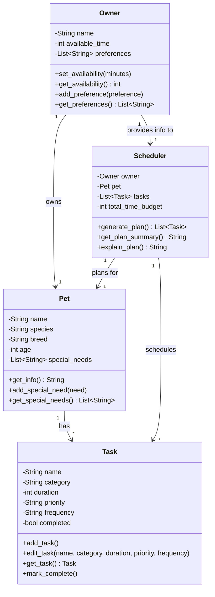

```mermaid
classDiagram
    class Owner {
        -String name
        -int available_time
        -List~String~ preferences
        +set_availability(minutes)
        +get_availability() int
        +add_preference(preference)
        +get_preferences() List~String~
    }

    class Pet {
        -String name
        -String species
        -String breed
        -int age
        -List~String~ special_needs
        +get_info() String
        +add_special_need(need)
        +get_special_needs() List~String~
    }

    class Task {
        -String name
        -String category
        -int duration
        -String priority
        -String frequency
        -bool completed
        +add_task()
        +edit_task(name, category, duration, priority, frequency)
        +get_task() Task
        +mark_complete()
    }

    class Scheduler {
        -Owner owner
        -Pet pet
        -List~Task~ tasks
        -int total_time_budget
        +generate_plan() List~Task~
        +get_plan_summary() String
        +explain_plan() String
    }

    Owner "1" --> "1" Pet : owns
    Owner "1" --> "1" Scheduler : provides info to
    Pet "1" --> "*" Task : has
    Scheduler "1" --> "*" Task : schedules
    Scheduler "1" --> "1" Pet : plans for
```
